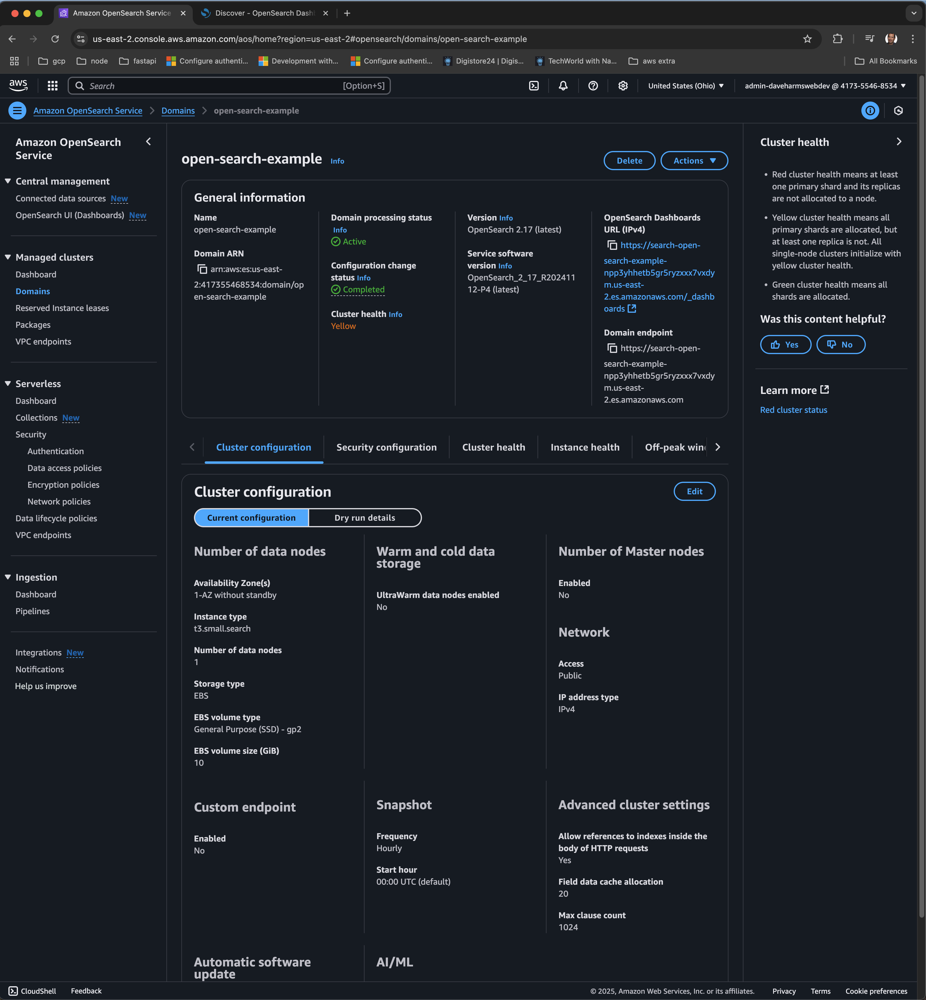
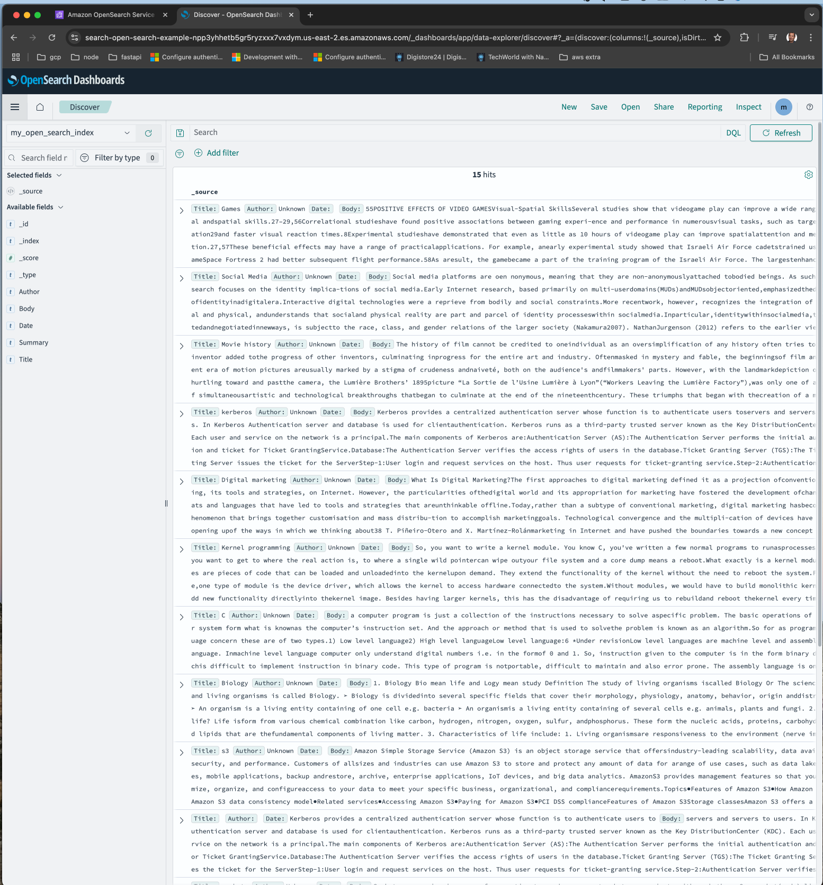
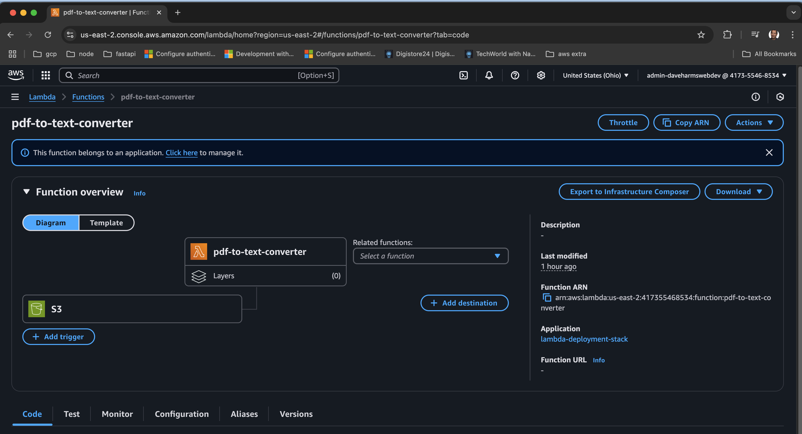
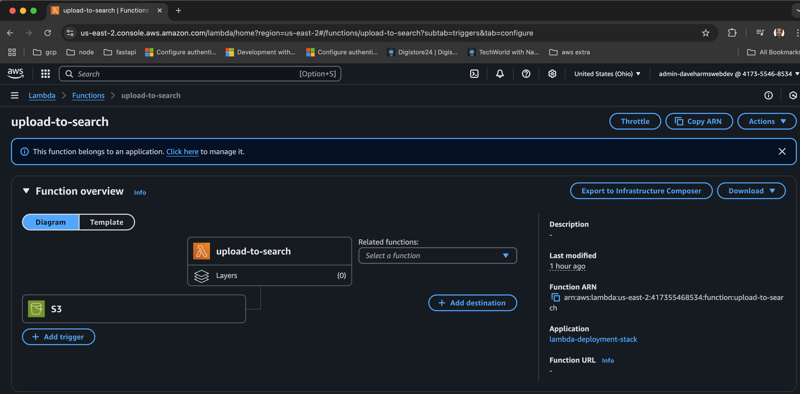
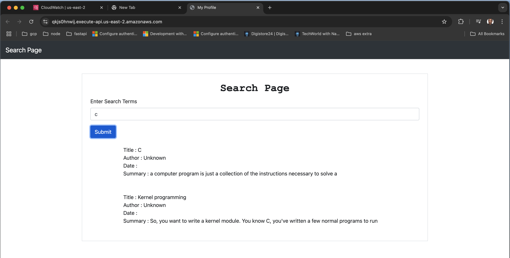
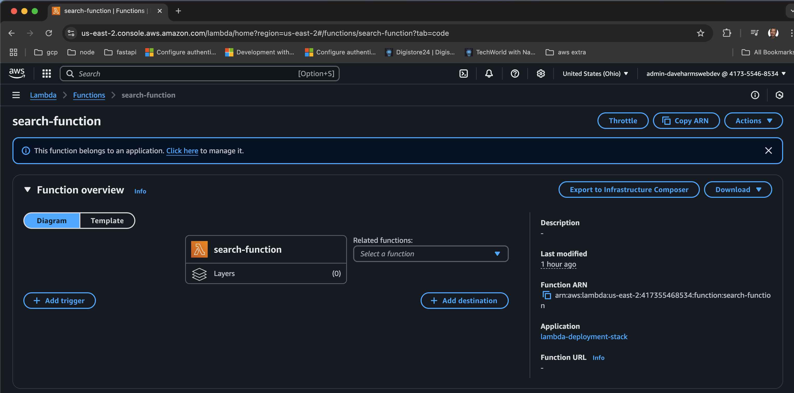
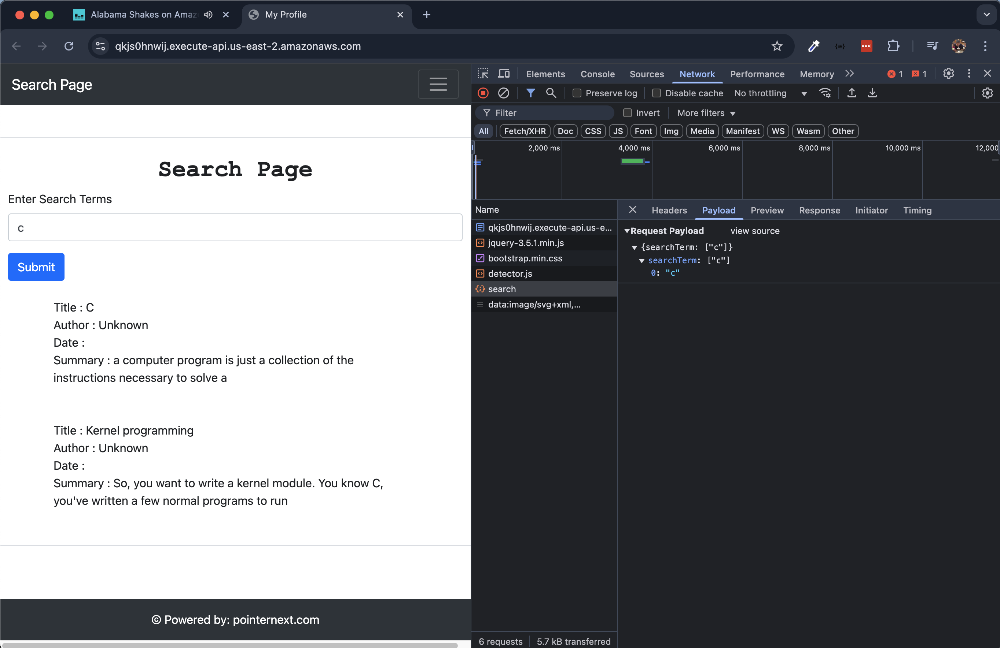
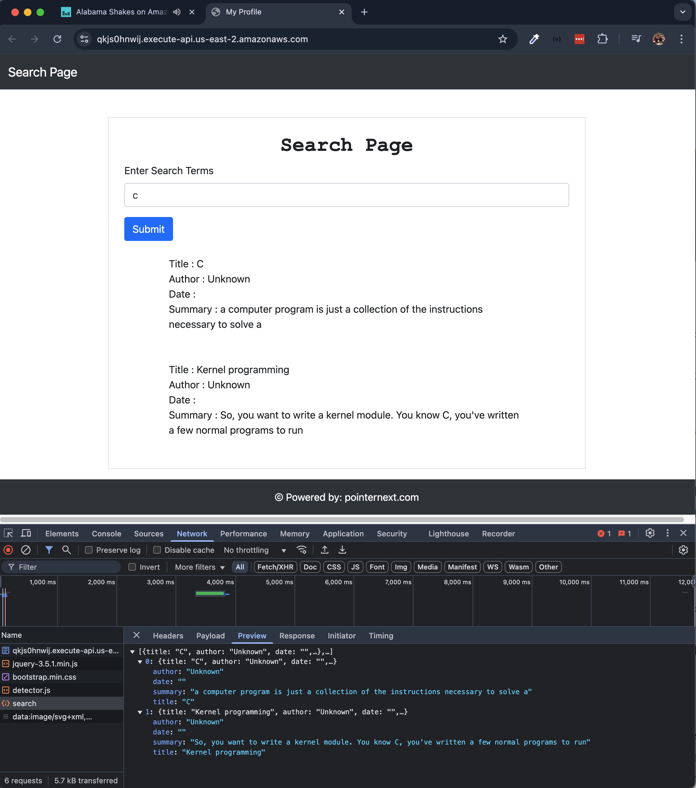

# Walter David Harms

## PGPCC | Project Deploying a search engine using AWS Managed Services

## Open Search Domain

I decided to do all my AWS provisioning with Terraform.  I did this with the previous project.
It's useful because I could spin it down and up as I needed to, this allowed me to save money.
Also, being able to spin the app up and down at will indicated that I understood the components of the app and their integration.

### Github: https://github.com/daveharmswebdev/search-engine-deployment

```text
❯ terraform output
api_gateway_endpoint = "https://qkjs0hnwij.execute-api.us-east-2.amazonaws.com"
api_gateway_id = "qkjs0hnwij"
api_gateway_stage_name = "$default"
api_gateway_url = "https://qkjs0hnwij.execute-api.us-east-2.amazonaws.com"
lambda_execution_role_arm = "arn:aws:iam::417355468534:role/lambda-execution-role"
lambda_pdf_text_function_arn = "arn:aws:lambda:us-east-2:417355468534:function:pdf-to-text-converter"
lambda_search_function_arn = "arn:aws:lambda:us-east-2:417355468534:function:search-function"
lambda_search_gateway_function_arn = "arn:aws:lambda:us-east-2:417355468534:function:search-gateway"
lambda_upload_to_search_arn = "arn:aws:lambda:us-east-2:417355468534:function:upload-to-search"
opensearch_dashboard_url = "search-open-search-example-npp3yhhetb5gr5ryzxxx7vxdym.us-east-2.es.amazonaws.com"
opensearch_domain_arn = "arn:aws:es:us-east-2:417355468534:domain/open-search-example"
opensearch_domain_endpoint = "search-open-search-example-npp3yhhetb5gr5ryzxxx7vxdym.us-east-2.es.amazonaws.com"
s3_bucket_arn = "arn:aws:s3:::pdf-bucket-cpnf2ube1t5m"
s3_bucket_name = "pdf-bucket-cpnf2ube1t5m"
```

I also rewrote the lambda's in Javascript.  This worked well in my development environment and within my dev process.
The pattern was to write the function, and then zip the function up and in the Terraform file committed to the lambda I tracked the zipped functions hash, and when I executed `terraform apply`, terraform knew to update the lambda function.

```terraform
resource "aws_lambda_function" "pdf_to_text_converter" {
  function_name = "pdf-to-text-converter"
  runtime       = "nodejs20.x"
  handler       = "index.handler"
  role          = aws_iam_role.lambda_execution_role.arn
  timeout       = 600
  filename      = "${path.module}/lambda-src/pdf-to-text/pdf-to-text.zip"

  source_code_hash = filebase64sha256("${path.module}/lambda-src/pdf-to-text/pdf-to-text.zip")

  environment {
    variables = {
      TARGET_BUCKET = aws_s3_bucket.pdf_bucket.bucket
    }
  }

  tags = {
    Service = "PDFToText"
  }
}
```

### Zipping up function

```text
❯ zip -r search-gateway.zip index.js package.json node_modules
updating: index.js (deflated 58%)
updating: node_modules/ (stored 0%)
updating: node_modules/.package-lock.json (deflated 37%)
updating: node_modules/querystring/ (stored 0%)
updating: node_modules/querystring/encode.d.ts (deflated 50%)
updating: node_modules/querystring/LICENSE (deflated 42%)
updating: node_modules/querystring/CHANGELOG.md (deflated 44%)
updating: node_modules/querystring/index.js (deflated 39%)
updating: node_modules/querystring/encode.js (deflated 51%)
updating: node_modules/querystring/decode.d.ts (deflated 54%)
updating: node_modules/querystring/README.md (deflated 44%)
updating: node_modules/querystring/decode.js (deflated 48%)
updating: node_modules/querystring/package.json (deflated 56%)
updating: node_modules/querystring/index.d.ts (deflated 60%)
updating: package.json (deflated 35%)
```

### Terraform Apply for function update

```text
❯ terraform apply

Terraform will perform the following actions:

  # aws_lambda_function.search_gateway will be updated in-place
  ~ resource "aws_lambda_function" "search_gateway" {
        id                             = "search-gateway"
      ~ last_modified                  = "2025-02-06T11:01:20.000+0000" -> (known after apply)
      ~ source_code_hash               = "VeFS3PxLikxN4oGuyRZO5bSigJElLGqvXVLXY39vpow=" -> "rrzlSl3bLF7HO5lRSzKlbdDrnYY1cmOH2brfuLh4dKw="
        tags                           = {
            "Service" = "SearchGateway"
        }
        # (27 unchanged attributes hidden)

        # (3 unchanged blocks hidden)
    }

Plan: 0 to add, 1 to change, 0 to destroy.

Do you want to perform these actions?
  Terraform will perform the actions described above.
  Only 'yes' will be accepted to approve.

  Enter a value: yes
```
### Provisioned Open Search Domain



### Open Search Dashboard



## Lambda Execution Role

```json
{
    "Statement": [
        {
            "Action": [
                "s3:GetObject",
                "s3:PutObject",
                "s3:ListBucket"
            ],
            "Effect": "Allow",
            "Resource": [
                "arn:aws:s3:::pdf-bucket-cpnf2ube1t5m",
                "arn:aws:s3:::pdf-bucket-cpnf2ube1t5m/*"
            ]
        },
        {
            "Action": [
                "logs:CreateLogGroup",
                "logs:CreateLogStream",
                "logs:PutLogEvents"
            ],
            "Effect": "Allow",
            "Resource": "*"
        }
    ],
    "Version": "2012-10-17"
}
```

### Pdf To Text Converter



### Pdf To Text Converter logs

#### Event

```text
2025-02-03T12:14:39.016Z	3fc85543-29b6-404d-a5e5-51ebeb303659	INFO	Received event:  {
    "Records": [
        {
            "eventVersion": "2.1",
            "eventSource": "aws:s3",
            "awsRegion": "us-east-2",
            "eventTime": "2025-02-03T12:14:37.710Z",
            "eventName": "ObjectCreated:Put",
            "userIdentity": {
                "principalId": "AWS:AIDAWCLCTB33BNLBZLZNY"
            },
            "requestParameters": {
                "sourceIPAddress": "69.226.237.216"
            },
            "responseElements": {
                "x-amz-request-id": "3A3C9H96M60ETEDA",
                "x-amz-id-2": "wKjEKSoyXhWEh9KVlXILoxY3qNUjWnHrnAfyO1gShvTFVzteZ+mAuukwLLzBH/6iCt8AqQS0RrD22ccPomx/jxEnxsw8jlsg"
            },
            "s3": {
                "s3SchemaVersion": "1.0",
                "configurationId": "tf-s3-lambda-20250125151942439100000001",
                "bucket": {
                    "name": "pdf-bucket-cpnf2ube1t5m",
                    "ownerIdentity": {
                        "principalId": "ATYWOA7GBH50M"
                    },
                    "arn": "arn:aws:s3:::pdf-bucket-cpnf2ube1t5m"
                },
                "object": {
                    "key": "MusicTheory.pdf",
                    "size": 28281,
                    "eTag": "d2b5d1094f1d0c092e86c436570a3bf1",
                    "sequencer": "0067A0B32D90E1D515"
                }
            }
        }
    ]
}
```
```text
2025-02-03T12:14:39.016Z	3fc85543-29b6-404d-a5e5-51ebeb303659	INFO	Processing file: MusicTheory.pdf from bucket: pdf-bucket-cpnf2ube1t5m
```

```text
2025-02-03T12:14:40.697Z	3fc85543-29b6-404d-a5e5-51ebeb303659	INFO	Successfully saved extracted text to MusicTheory.txt
```

```text
REPORT RequestId: 3fc85543-29b6-404d-a5e5-51ebeb303659	Duration: 1760.08 ms	Billed Duration: 1761 ms	Memory Size: 128 MB	Max Memory Used: 103 MB	
```

### Upload to Open Search



```text
2025-02-03T12:13:07.818Z	3b9380b5-28e6-418c-bf1f-757efd021cfa	INFO	Response: {
  _index: 'my_open_search_index',
  _id: 'Games.txt',
  _version: 1,
  result: 'created',
  _shards: { total: 2, successful: 1, failed: 0 },
  _seq_no: 0,
  _primary_term: 1
}
```

### Search Gateway


### Search Gateway In The Browser



### Search Function



### Payload sent to Search Function Lambda from Browser

#### Browser with Dev Tools



```text
2025-02-06T12:39:03.249Z	a6d17878-6a15-41c7-b344-1c13197aa239	INFO	Parsed request body: { searchTerm: [ 'c' ] }
```

### Request (Query) To OpenSearch

```text
2025-02-06T12:39:03.250Z	a6d17878-6a15-41c7-b344-1c13197aa239	INFO	Sending query to OpenSearch... {
  size: 25,
  query: { multi_match: { query: 'c', fields: [Array] } },
  fields: [ 'Title', 'Author', 'Date', 'Summary' ]
}
```

### Response from OpenSearch (Log Grab from CloudWatch)

```json
2025-02-06T12:39:03.488Z	a6d17878-6a15-41c7-b344-1c13197aa239	INFO	Search response: {
    "took": 18,
    "timed_out": false,
    "_shards": {
        "total": 5,
        "successful": 5,
        "skipped": 0,
        "failed": 0
    },
    "hits": {
        "total": {
            "value": 2,
            "relation": "eq"
        },
        "max_score": 1.3112575,
        "hits": [
            {
                "_index": "my_open_search_index",
                "_id": "C.txt",
                "_score": 1.3112575,
                "_source": {
                    "Title": "C",
                    "Author": "Unknown",
                    "Date": "",
                    "Body": "a computer program is just a collection of the instructions necessary to solve aspecific problem. The basic operations of a computer system form what is knownas the computer’s instruction set. And the approach or method that is used to solvethe problem is known as an algorithm.So for as programming language concern these are of two types.1) Low level language2) High level languageLow level language:6 *Under revisionLow level languages are machine level and assembly level language. Inmachine level language computer only understand digital numbers i.e. in the formof 0 and 1. So, instruction given to the computer is in the form binary digit, whichis difficult to implement instruction in binary code. This type of program is notportable, difficult to maintain and also error prone. The assembly language is onother hand modified version of machine level language. Where instructions aregiven in English like word as ADD, SUM, MOV etc. It is easy to write andunderstand but not understand by the machine. So the translator used here isassembler to translate into machine level. Although language is bit easier,programmer has to know low level details related to low level language. In theassembly level language the data are stored in the computer register, which variesfor different computer. Hence it is not portable.High level language:These languages are machine independent, means it is portable. The language inthis category is Pascal, Cobol, Fortran etc. High level languages are understood bythe machine. So it need to translate by the translator into machine level. Atranslator is software which is used to translate high level language as well as lowlevel language in to machine level language.Three types of translator are there:CompilerInterpreterAssemblerCompiler and interpreter are used to convert the high level language into machinelevel language. The program written in high level language is known as sourceprogram and the corresponding machine level language program is called as objectprogram. Both compiler and interpreter perform the same task but there working isdifferent. Compiler read the program at-a-time and searches the error and liststhem. If the program is error free then it is converted into object program. Whenprogram size is large then compiler is preferred. Whereas interpreter read only oneline of the source code and convert it to object code. If it check error, statement bystatement and hence of take more time.7 *Under revisionIntegrated Development Environments (IDE)The process of editing, compiling, running, and debugging programs is oftenmanaged by a single integrated application known as an Integrated DevelopmentEnvironment, or IDE for short. An IDE is a windows-based program that allows usto easily manage large software programs, edit files in windows, and compile, link,run, and debug programs.On Mac OS X, CodeWarrior and Xcode are two IDEs that are used by manyprogrammers. Under Windows, Microsoft Visual Studio is a good example of apopular IDE. Kylix is a popular IDE for developing applications under Linux.Most IDEs also support program development in several different programminglanguages in addition to C, such as C# and C++.",
                    "Summary": "a computer program is just a collection of the instructions necessary to solve a"
                },
                "fields": {
                    "Title": [
                        "C"
                    ],
                    "Author": [
                        "Unknown"
                    ],
                    "Summary": [
                        "a computer program is just a collection of the instructions necessary to solve a"
                    ],
                    "Date": [
                        ""
                    ]
                }
            },
            {
                "_index": "my_open_search_index",
                "_id": "Kernelprogramming.txt",
                "_score": 1.0389278,
                "_source": {
                    "Title": "Kernel programming",
                    "Author": "Unknown",
                    "Date": "",
                    "Body": "So, you want to write a kernel module. You know C, you've written a few normal programs to runasprocesses, and now you want to get to where the real action is, to where a single wild pointercan wipe outyour file system and a core dump means a reboot.What exactly is a kernel module? Modules are pieces of code that can be loaded and unloadedinto the kernelupon demand. They extend the functionality of the kernel without the need to reboot the system.For example,one type of module is the device driver, which allows the kernel to access hardware connectedto the system.Without modules, we would have to build monolithic kernels and add new functionality directlyinto thekernel image. Besides having larger kernels, this has the disadvantage of requiring us to rebuildand reboot thekernel every time we want new functionality.",
                    "Summary": "So, you want to write a kernel module. You know C, you've written a few normal programs to run"
                },
                "fields": {
                    "Title": [
                        "Kernel programming"
                    ],
                    "Author": [
                        "Unknown"
                    ],
                    "Summary": [
                        "So, you want to write a kernel module. You know C, you've written a few normal programs to run"
                    ],
                    "Date": [
                        ""
                    ]
                }
            }
        ]
    }
}
```

### Response from function sent back to Browser

```text
2025-02-06T12:39:03.488Z	a6d17878-6a15-41c7-b344-1c13197aa239	INFO	Final results: [{
    "title": "C",
    "author": "Unknown",
    "date": "",
    "summary": "a computer program is just a collection of the instructions necessary to solve a"
},{
    "title": "Kernel programming",
    "author": "Unknown",
    "date": "",
    "summary": "So, you want to write a kernel module. You know C, you've written a few normal programs to run"
}]
```

### Browser With DevTools Showing Response



## Teardown

```text
Do you really want to destroy all resources?
  Terraform will destroy all your managed infrastructure, as shown above.
  There is no undo. Only 'yes' will be accepted to confirm.

  Enter a value: yes

aws_lambda_permission.allow_s3_invoke_lambda: Destroying... [id=AllowS3InvokeLambda]
aws_s3_bucket_notification.s3_event_notification: Destroying... [id=pdf-bucket-cpnf2ube1t5m]
aws_s3_bucket_policy.pdf_bucket_access_block: Destroying... [id=pdf-bucket-cpnf2ube1t5m]
aws_apigatewayv2_route.search_route: Destroying... [id=wbyn8fv]
aws_iam_role_policy_attachment.attach_lambda_s3_policy: Destroying... [id=lambda-execution-role-20250125145108534000000001]
aws_apigatewayv2_route.search_route_post: Destroying... [id=qgmiqnj]
aws_apigatewayv2_stage.api_gateway_stage: Destroying... [id=$default]
aws_lambda_permission.allow_api_gateway_invoke_search_function: Destroying... [id=AllowAPIGatewayInvokeSearchFunction]
aws_lambda_permission.allow_s3_invoke_upload_to_search: Destroying... [id=AllowS3InvokeUploadToSearch]
aws_lambda_permission.search_gateway_permission: Destroying... [id=AllowAPIGatewayInvoke]
aws_lambda_permission.allow_api_gateway_invoke_search_function: Destruction complete after 0s
aws_lambda_permission.allow_s3_invoke_upload_to_search: Destruction complete after 0s
aws_lambda_permission.allow_s3_invoke_lambda: Destruction complete after 0s
aws_lambda_permission.search_gateway_permission: Destruction complete after 0s
aws_iam_role_policy_attachment.attach_lambda_s3_policy: Destruction complete after 0s
aws_iam_policy.lambda_s3_policy: Destroying... [id=arn:aws:iam::417355468534:policy/lambda-s3-policy]
aws_apigatewayv2_route.search_route: Destruction complete after 0s
aws_apigatewayv2_integration.search_gateway_integration: Destroying... [id=ku1zqfc]
aws_apigatewayv2_route.search_route_post: Destruction complete after 0s
aws_apigatewayv2_integration.search_function_integration: Destroying... [id=gosee1h]
aws_apigatewayv2_stage.api_gateway_stage: Destruction complete after 0s
aws_apigatewayv2_integration.search_gateway_integration: Destruction complete after 0s
aws_lambda_function.search_gateway: Destroying... [id=search-gateway]
aws_apigatewayv2_integration.search_function_integration: Destruction complete after 0s
aws_lambda_function.search_function: Destroying... [id=search-function]
aws_apigatewayv2_api.api_gateway: Destroying... [id=qkjs0hnwij]
aws_s3_bucket_notification.s3_event_notification: Destruction complete after 0s
aws_lambda_function.pdf_to_text_converter: Destroying... [id=pdf-to-text-converter]
aws_lambda_function.upload_to_search: Destroying... [id=upload-to-search]
aws_iam_policy.lambda_s3_policy: Destruction complete after 0s
aws_lambda_function.upload_to_search: Destruction complete after 0s
aws_lambda_function.search_gateway: Destruction complete after 0s
aws_lambda_function.search_function: Destruction complete after 0s
aws_opensearch_domain.open_search_domain: Destroying... [id=arn:aws:es:us-east-2:417355468534:domain/open-search-example]
aws_lambda_function.pdf_to_text_converter: Destruction complete after 0s
aws_iam_role.lambda_execution_role: Destroying... [id=lambda-execution-role]
aws_s3_bucket_policy.pdf_bucket_access_block: Destruction complete after 0s
aws_s3_bucket.pdf_bucket: Destroying... [id=pdf-bucket-cpnf2ube1t5m]
aws_iam_role.lambda_execution_role: Destruction complete after 0s
aws_apigatewayv2_api.api_gateway: Destruction complete after 0s
aws_opensearch_domain.open_search_domain: Still destroying... [id=arn:aws:es:us-east-2:417355468534:domain/open-search-example, 10s elapsed]
aws_opensearch_domain.open_search_domain: Still destroying... [id=arn:aws:es:us-east-2:417355468534:domain/open-search-example, 20s elapsed]
aws_opensearch_domain.open_search_domain: Still destroying... [id=arn:aws:es:us-east-2:417355468534:domain/open-search-example, 30s elapsed]
aws_opensearch_domain.open_search_domain: Still destroying... [id=arn:aws:es:us-east-2:417355468534:domain/open-search-example, 40s elapsed]
aws_opensearch_domain.open_search_domain: Still destroying... [id=arn:aws:es:us-east-2:417355468534:domain/open-search-example, 50s elapsed]
...
...
...
...
...
...
aws_opensearch_domain.open_search_domain: Still destroying... [id=arn:aws:es:us-east-2:417355468534:domain/open-search-example, 10m20s elapsed]
aws_opensearch_domain.open_search_domain: Still destroying... [id=arn:aws:es:us-east-2:417355468534:domain/open-search-example, 10m30s elapsed]
aws_opensearch_domain.open_search_domain: Still destroying... [id=arn:aws:es:us-east-2:417355468534:domain/open-search-example, 10m40s elapsed]
aws_opensearch_domain.open_search_domain: Destruction complete after 10m41s
╷
│ Error: deleting S3 Bucket (pdf-bucket-cpnf2ube1t5m): operation error S3: DeleteBucket, https response error StatusCode: 409, RequestID: 30KW3AB49XTAKBMB, HostID: A9wXzEhRohvf5kcMIzdHCWIoywDkRwBGSEwmUOEdevugsmOMgsyuEw+CvZxz+3zwf6oYi+hcQ9o=, api error BucketNotEmpty: The bucket you tried to delete is not empty
│ 
│ 
╵
```

>> ...After deleting contents of bucket

```text
Plan: 0 to add, 0 to change, 2 to destroy.

Changes to Outputs:
  - api_gateway_stage_name = "$default" -> null
  - s3_bucket_arn          = "arn:aws:s3:::pdf-bucket-cpnf2ube1t5m" -> null
  - s3_bucket_name         = "pdf-bucket-cpnf2ube1t5m" -> null

Do you really want to destroy all resources?
  Terraform will destroy all your managed infrastructure, as shown above.
  There is no undo. Only 'yes' will be accepted to confirm.

  Enter a value: yes

aws_s3_bucket.pdf_bucket: Destroying... [id=pdf-bucket-cpnf2ube1t5m]
aws_s3_bucket.pdf_bucket: Destruction complete after 0s
random_string.bucket_suffix: Destroying... [id=cpnf2ube1t5m]
random_string.bucket_suffix: Destruction complete after 0s

Destroy complete! Resources: 2 destroyed.
```

## Lessons And Observations

This was a fun introduction into OpenSearch.  I had heard of Elastic Search and seen it implemented in a previous job, however I was not on that team.

Though this was my first time working with AWS Lambda, I was familiar with Azure serverless functions and worked with them.  The one Azure function that worked with was a cron job, and that seems like a more appropriate use for serverless functions.  This app, while interesting to see how serverless functions can comprise a working app, seemed like an anti-pattern.

An app like this makes more sense as a traditional app, like Dotnet with Razor pages, or Python Django, or Ruby on Rails.  I found the development experience of the functions to be strenuous, whether I was testing in the console or developing on my machine and pushing up.  Though developing and pushing with Terraform was not slow, it wasn’t quick either.  It wasn’t the worse dev experience; it wasn’t pleasant either.  It’s not a choice I would advocate for.

I also did not like the Cloudformation experience either.  Compared to CI/CD predicated on Github actions or Gitlab CI/CD, it comes in third.  Again, it has to do with the dev experience.  Github and Gitlab CI/CD is primarily composed with YAML files.  CodeBuild and Codedeploy requires so much GUI.  The problem with so much GUI is that its difficult to discern what is needed and what is not needed.  You scroll to the bottom click the button and then you find out there is a required field.  On the other hand, working with a YAML file and committing you get the excellent feedback of error messages and logging.  And when it does work, you now have documentation (and version control).

IAC is much more preferable to using the console.  Navigating your own files in your own IDE opposed to playing around the AWS GUI console, there is no comparison.  One is significantly slower and easy to lose track of what you have provisioned.  Terraform is the standard way of provisioning AWS, Azure and GCP infrastructure in my shop.
